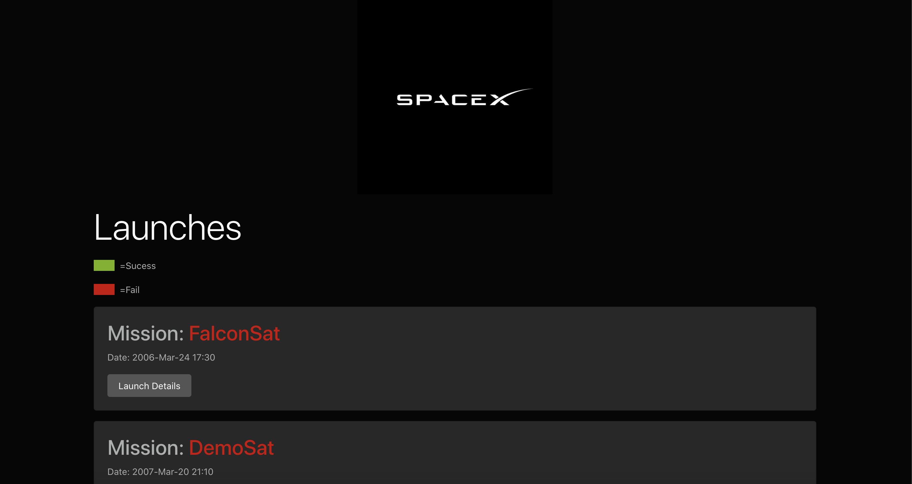
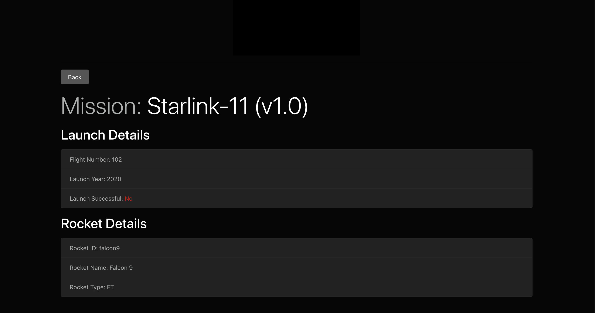

# SpaceX Flight Log


## Project Description

This project resembles a flight log of SpaceX's spacecraft program. This application shows if tests were successful or failed, over the may crafts that SpaceX has tested. 

This was a project follow along with Traversy Media's tutorial on learning GraphQL with react, using SpaceX's API. 

## Deployment

[Deployemnt Link](https://sheltered-tor-03736.herokuapp.com/)


## Table of Contents
  * [Installation](#installation)
  * [Usage](#usage)
  * [Project Technology](#project-technology)
  * [Screenshots of Application](#screenshots-of-application)
  * [Contributing Authors](#contributing-authors)

----
## Installation
To install, run following command in terminal:
  
```
npm i
```

 
----

## Project Technology
<details>
    <summary markdown="span">Click to expand Project Technology Details</summary>

Languages
- HTML
- CSS
- Javascript


Libraries
- [React.js](reactjs.org)
- [Node.js](nodejs.org)

npm Packages
-grapghql
-express
-express-graphql
-eslint
-axios
-concurrently
-cors
-react
-react-apollo
-react-moment
-moment
-react-router-dom

CSS Framework
- bootstrap

Cloud Server
- [Heroku](heroku.com/)

</details>


## Screenshots of Application



*Screenshot of Homescreen*


*Screenshot of Lauch Details*


## Contributing Authors

[Andrew Greer](https://github.com/andrewpaulgreer)